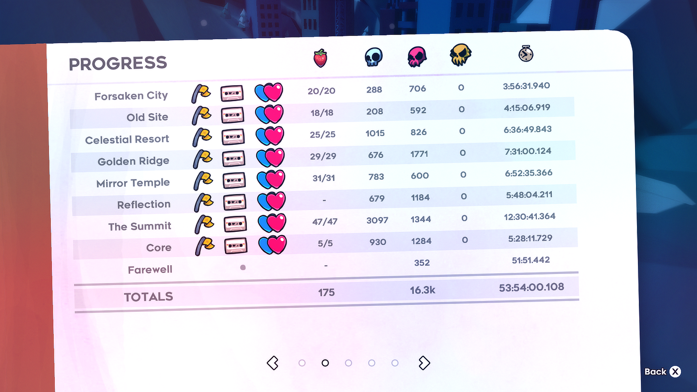

# Celeste Save Files :strawberry:

What a great game! This is just to sync my save files from my desktop to my laptop. 
I'm using the itch.io version by the way. I got this idea from Spencer at the
[Outernet](https://github.com/hackclub/outernet)! (actually, Steam Cloud syncs files, so... maybe just
buy the steam version lol)

> game progress as of *2023-10-11 in `0.celeste`*

## Where is the Saves directory?

- Mac directory: `~/Library/Application Support/Celeste/Saves`
- Windows directory: `<where-you-put-it>/Celeste/Saves`

## Quickly Save and Update

- Mac: create aliases in your `.zshrc` or wherever your terminal loads stuff from
    - `alias celeste-pull="cd ~/Library/Application\ Support/Celeste/Saves && make pull"`
    - `alias celeste-push="cd ~/Library/Application\ Support/Celeste/Saves && make push"`

- Windows:
    - copy the cmd scripts in `win-shortcuts` to your home dir or wherever your terminal opens to
    - you will need `make` but you can simply swap the command into the .cmd files anyway
    - I really don't like windows, unix is so much better
